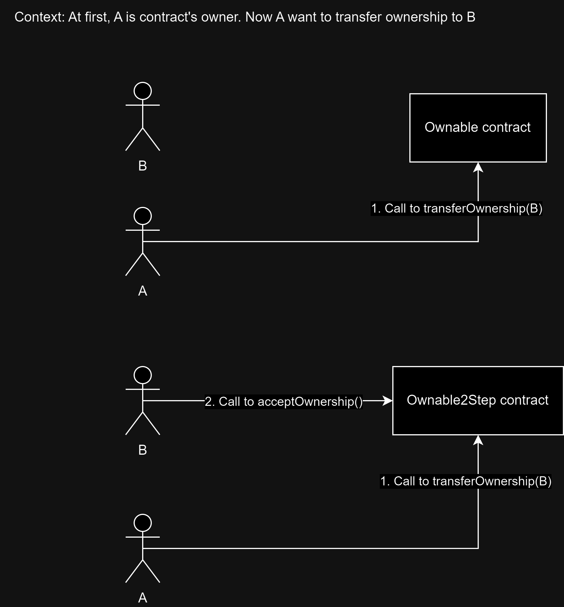
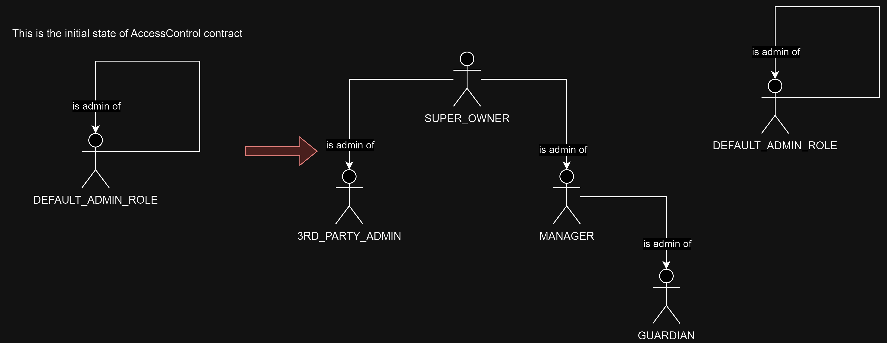

## 1.1 OZ's Ownable
https://github.com/OpenZeppelin/openzeppelin-contracts/blob/master/contracts/access/Ownable.sol

Summary: An abstract contract that help inheritance contract have a contract owner. Note that it can have only one owner

In detail:
    - `Modifier onlyOwner()`: modifier that check if msg.sender is contract's owner or not, if no then it will revert
    - `Function renounceOwnership()`: can only be called by owner, remove ownership of msg.sender, make the contract ownerless
    - `Function transferOwnership(address newOwner)`: can only be called by owner, remove ownership of the caller and set new owner to any address 


How to use:

- Add modifier onlyOwner for a function that you want to only be called by owner

- Note: In OpenZeppelin library version `< v5.0.0`, Ownable contract assumes caller who deploys the contract as the contract owner. To change that, you can do this in `constructor()`:
```solidity
constructor(address newOwner) {
    ...
    transferOwnership(newOwner);
}
```
- Note: In OpenZeppelin library version `>= v5.0.0`, contract owner must be set to input address in constructor, unlike `< v5.0.0` which set contract deployer as owner by default:
```solidity
constructor(address owner) Ownable(owner) {
    ...
}
```


## 1.2 OZ's Ownable2Step
https://github.com/OpenZeppelin/openzeppelin-contracts/blob/master/contracts/access/Ownable2Step.sol

Summary: Similar to Ownable but when transfering ownership, pending new owner must need an extra step to accept it to become the new owner. This contract existed to prevent transfering ownership to an uncontrolled/wrong address 

In detail:
- `Modifier onlyOwner()`
- `Function renounceOwnership()`
- `Function transferOwnership(address newOwner)`: can only be called by owner, set the pending owner to any address 
- `Function acceptOwnership()`: can only be called by pending owner, remove current owner, change pending owner (or msg.sender) to become new owner 
How to use:
- Just like Ownable
- We need two steps to successfully transfer ownership:
    + Current owner call to transferOwnership()
    + Soon-to-be owner call acceptOwnership()



## 1.3 OZ's AccessControl
https://github.com/OpenZeppelin/openzeppelin-contracts/blob/master/contracts/access/AccessControl.sol

Summary: When a contract need to a role system that have more than one role OR each role have more than one address OR each address can have more than one role, we can use AccessControl to achieve that

In detail:

- If role A is an admin of role B, it means address that have role A can add grant/revoke role B from arbitrary addresses

- Exposed function:
    + `modifier onlyRole(bytes32 role)`: modifier that check if msg.sender is contract's role in the input or not, if no then it will revert
    + `function grantRole(bytes32 role, address account)`: can only be called by admin role of the granted role, grant role to input account
    + `function revokeRole(bytes32 role, address account)`: can only be called by admin role of the revoked role, revoke role to input account
    + `function renounceRole(bytes32 role, address callerConfirmation)`: revoke the role of msg.sender


How to use:

- Note: By default, DEFAULT_ADMIN_ROLE is the admin of all roles, included itself 
- Let say you want to build contract that have 4 roles:
    + `SUPER_OWNER`: can be only be 1 address and is contract deployer, can grant/revoke role for `MANAGER`, `3RD_PARTY_ADMIN`
    + `MANAGER`: can grant/revoke role for GUARDIAN
    + `GUARDIAN`:
    + `3RD_PARTY_ADMIN`:
- Here's the diagram of how things should be:

- Here's how we can achieve in code:
```solidity
// SPDX-License-Identifier: GPL-3.0

pragma solidity >=0.7.0 <0.9.0;

import "@openzeppelin/contracts/access/AccessControl.sol";

contract A is AccessControl {
    bytes32 constant SUPER_OWNER = keccak256("SUPER_OWNER");
    bytes32 constant MANAGER = keccak256("MANAGER");
    bytes32 constant GUARDIAN = keccak256("GUARDIAN");
    bytes32 constant THIRD_PARTY_ADMIN = keccak256("THIRD_PARTY_ADMIN");

    constructor() {
        //no one is DEFAULT_ADMIN_ROLE

        // set SUPER_OWNER role to msg.sender
        _grantRole(SUPER_OWNER, msg.sender);

        // set admin
        _setRoleAdmin(MANAGER, SUPER_OWNER);
        _setRoleAdmin(THIRD_PARTY_ADMIN, SUPER_OWNER);
        _setRoleAdmin(GUARDIAN, MANAGER);
    }
}
```
- To build a function that can only be called by a specific role, simply put modifier `onlyRole(bytes32 role)` in the function

## 1.4 OZ's AccessControlEnumerable
https://github.com/OpenZeppelin/openzeppelin-contracts/blob/master/contracts/access/extensions/AccessControlEnumerable.sol

Summary: Just like AccessControlEnumerable but we can query all (or with index) user that have a specific role onchain -> TODO

In detail:
- Addition to AccessControl, AccessControlEnumerable contract have a mapping `mapping(bytes32 role => EnumerableSet.AddressSet) private _roleMembers;` (more about EnumerableSet.AddressSet in 4.3.3) which basically can be treated as an array, hence it will be able to query with index or query all address that have a specific role


How to use:
- `function getRoleMember(bytes32 role, uint256 index) public view returns (address)`: return an address with a specific role that in a particular index
- `function getRoleMemberCount(bytes32 role) public view returns (uint256)`: return total number of address that have a specific role
- `function getRoleMembers(bytes32 role) public view returns (address[] memory)`: return all address that have a specific role